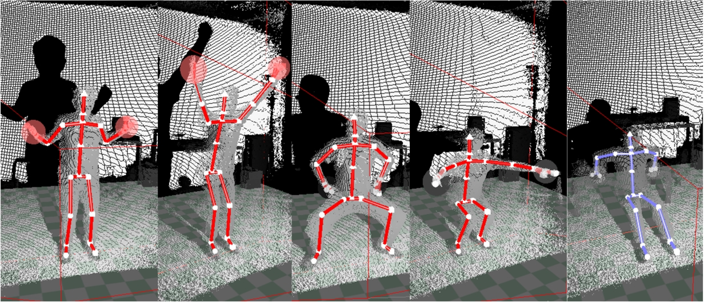
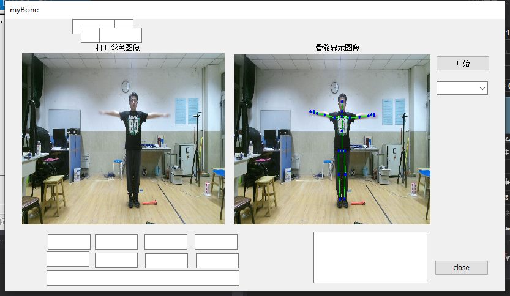
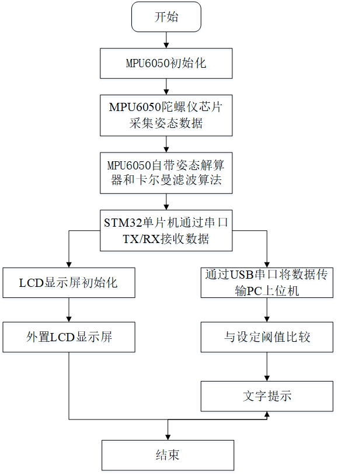
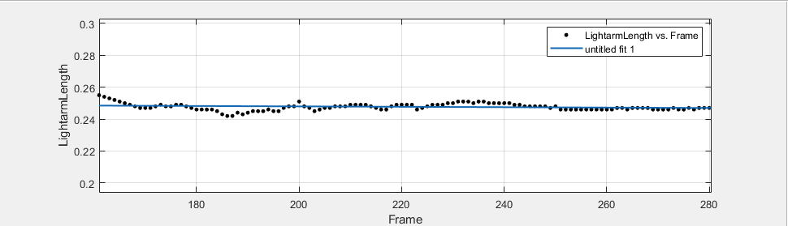
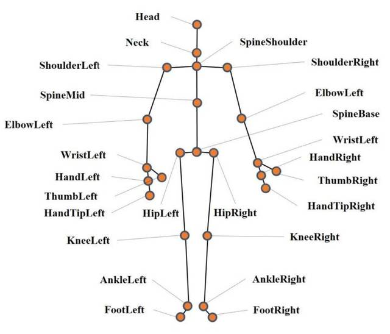

# Kinect-Based Human Pose Estimation and Analysis System

This project is a full-featured application for extracting human skeleton data using Kinect and evaluating fitness movements based on joint angles and bone lengths. It was developed as a graduation thesis project at Jinan University.




## 📌 Features

- 🎯 Real-time skeleton tracking using Kinect 2.0
- 📐 Joint angle measurement for fitness posture evaluation
- 🧠 Curve-fitting filter to estimate bone lengths
- 🏋️ Five predefined fitness action templates
- 📊 Automatic feedback on posture correctness
- 🖥️ Developed using Visual Studio (MFC, C++)
- 🔧 Includes lower-computer module for Kinect pose calibration

## 📁 Project Structure

```
kinect-skeleton-fitness/
├── README.md                 <- Project description (this file)
├── docs/
│   └── thesis_summary_en.md <- Translated thesis summary (to be filled)
├── images/                   <- Diagrams, screenshots, charts
├── src/                      <- C++ source code (to be added)
└── data/                     <- Optional: sample motion data / skeleton logs
```

## 🖼️ System Overview

### System Workflow
The system performs the following steps:
1. Capture RGB + Depth + Skeleton data from Kinect
2. Preprocess skeleton data: trimming, normalization, smoothing
3. Measure bone lengths and joint angles
4. Compare user's joint angles to reference templates
5. Display real-time feedback on posture accuracy
6. Support for Kinect attitude correction using MPU6050 and STM32



## 🔧 Technical Stack

- Kinect for Windows SDK 2.0
- Visual Studio 2017 + MFC
- C++ with Windows GUI support
- Optional: MATLAB for curve fitting

## 📊 Experimental Results

- Average bone length errors below ±1cm compared to manual measurements
- Successfully differentiated between proper/improper squat, back and arm postures
- Supported multiple users with varying body sizes and distances




## 📚 Documentation

📄 [Thesis Summary (English)](docs/thesis_summary_en.md)  
📄 [Original Thesis (Chinese)](Not Included - PDF Format)

## 🚀 Future Improvements

- Automatic action classification using machine learning
- Multi-camera skeleton fusion for occlusion resistance
- Integration with web dashboard for progress tracking

## 📝 License

To be added — MIT or Apache 2.0 recommended for open source use.
